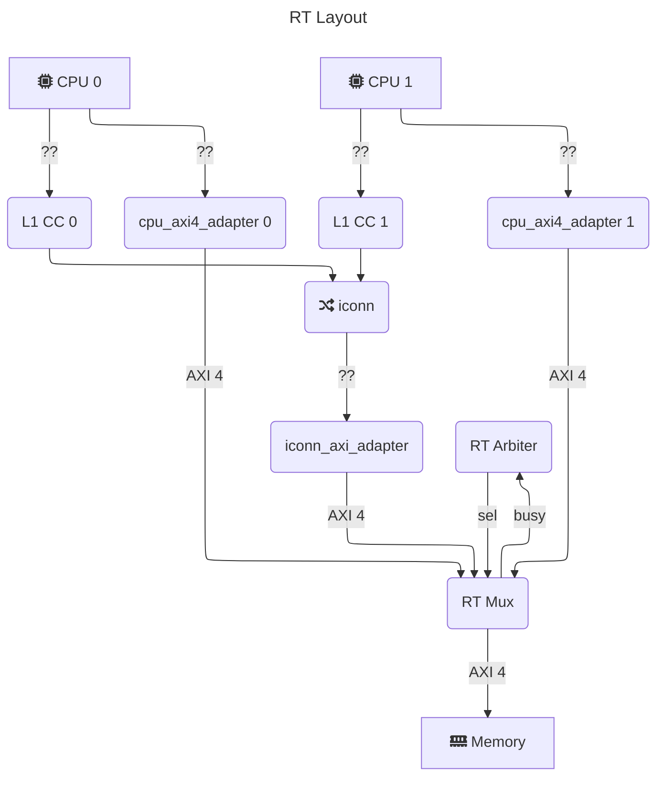

# RT memory bypass

## Diagram

```mermaid
---
title: RT Layout
config:
  layout: elk
---
flowchart TD
    C0[fa:fa-microchip CPU 0] -->|??| CC_0(L1 CC 0)
    CC_0 --> ic(fa:fa-shuffle iconn)
    C0 -->|??| c2axi_0(cpu_axi4_adapter 0)

    C1[fa:fa-microchip CPU 1] -->|??| CC_1(L1 CC 1)
    CC_1 --> ic
    C1 -->|??| c2axi_1(cpu_axi4_adapter 1)

    ic -->|??| ic2axi(iconn_axi_adapter)

    c2axi_0 --> |AXI 4| mux
    ic2axi --> |AXI 4| mux(RT Mux)
    c2axi_1 --> |AXI 4| mux

    mux --> |AXI 4| MEM[fa:fa-memory Memory]
    mux --> |busy| arb(RT Arbiter)
    arb --> |sel| mux 

```